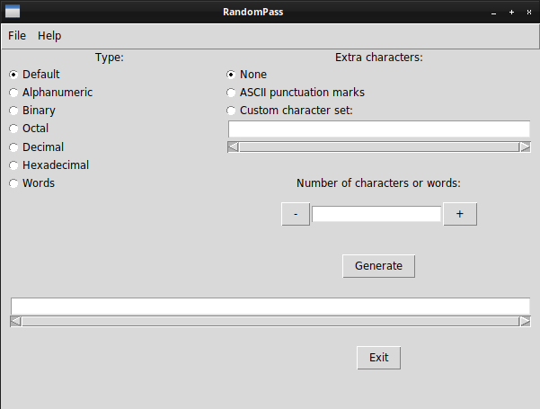

# RandomPass
### Generate a random password or passphrase.

**Requirements:**
- Python 3.6 or newer
- nltk 3.0 or newer

This project is licensed under the Apache License 2.0. [Learn more.](https://choosealicense.com/licenses/apache-2.0/)

The program can generate various passwords with random characters or passphrases with random English words.<br>
You have the option to generate passwords or passphrases containing the following sets:
- ASCII characters from 33 to 126
- alphanumeric only &mdash; ASCII 48-57, 65-90, and 97-122
- binary only &mdash; digits from 0 to 1
- octal only &mdash; digits from 0 to 7
- decimal only &mdash; digits from 0 to 9
- hexadecimal only &mdash; digits from 0 to F
- words &mdash; randomly chosen English words from a dictionary of over 236&nbsp;000 words

You can add your own characters to each and have the program randomly pick from those as well. In case of a passphrase, a random number of them will be picked and placed at random positions into the passphrase.

---

### Usage
#### Command line
```
usage: randompass.py [-h|-a|-b|-o|-d|-x|-u] [-e] | [-w] [-e]] number [custom-set]

Generate a random password or passphrase

positional arguments:
  number                number of characters or words, a positive integer
  custom-set            a custom set of characters

optional arguments:
  -h, --help            show this help message and exit
  -a, --alphanumeric    use alphanumeric ASCII only
  -b, --binary          use binary digits only
  -o, --octal           use octal digits only
  -d, --decimal         use decimal digits only
  -x, --hexadecimal     use hexadecimal digits only
  -w, --words           create passphrase from English words
  -e, --extra-characters
                        mix extra characters in. Use custom-set if provided or
                        fall back to ASCII punctuation marks
  -u, --update-words    update word list and exit

```

#### Graphical user interface
Self-explanatory:


